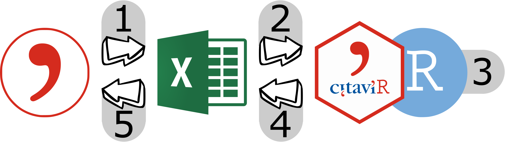

```{r, include = FALSE, warning = FALSE, message = FALSE}
knitr::opts_chunk$set(
  collapse = TRUE,
  comment = "#>",
  fig.path = "man/figures/README-",
  out.width = "100%"
)
```

# CitaviR 

<!-- badges: start -->
[](https://www.repostatus.org/#active)
[](https://www.tidyverse.org/lifecycle/#experimental)
<!-- [](https://travis-ci.com/SchmidtPaul/CitaviR) -->
<!-- [](https://ci.appveyor.com/project/SchmidtPaul/CitaviR) -->
<!-- badges: end -->

> This is an unofficial helper package for dealing with Citavi. </br>
> I am not affiliated with Citavi, just a fan.

The reference management software **Citavi** ([Official Website](https://www.citavi.com/de), [Official GitHub](https://github.com/Citavi)) allows for [exports to Excel](https://www1.citavi.com/sub/manual6/en/index.html?exporting_to_excel.html). With a bit of effort (i.e. via customized [Citavi macros](https://www1.citavi.com/sub/manual6/en/index.html?add_on_display_macros.html)) it also allows for [imports from Excel](https://github.com/Citavi/Macros/blob/master/CIM%20Import/CIM007%20Import%20arbitrary%20data%20from%20Microsoft%20Excel%20into%20custom%20fields%20of%20existing%20references%20by%20short%20title/readme.de.md). `CitaviR` provides functionality for dealing with the data while it is *outside* Citavi to get the most out of it. Using CitaviR goes hand in hand with using the custom Citavi macros in the [CitaviRMacros repository](https://github.com/SchmidtPaul/CitaviRMacros).

## Installation

You can install the development version of `CitaviR` from GitHub:

```{r install_devtools, eval=FALSE}
devtools::install_github('SchmidtPaul/CitaviR')
```

## Workflow

The entire work flow from start to finish is structured in five steps.

```{r, echo=FALSE, out.width = "66%"}

```

Step | CitaviR | Effort: 1st time setup | Effort: regular use
-|-|-|-
Step 1: Citavi to xlsx       |                    | :ok_hand: | :smiley:
Step 2: xlsx to R                | :heavy_check_mark: | :smiley:  | :smiley:
Step 3: Process data in R | :heavy_check_mark: | :ok_hand: | :smiley:
Step 4: R to xlsx                 | :heavy_check_mark: | :smiley:  | :smiley:
Step 5: xlsx to Citavi       |                    | :fire:    | :ok_hand:

**Effort levels:** low effort :smiley:; acceptable effort :ok_hand:; can be cumbersome :fire: 

### Example

Click here to find an example for such a workflow (and also other resources).
