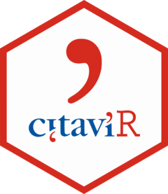

```{r, include = FALSE, warning = FALSE, message = FALSE}
knitr::opts_chunk$set(
  collapse = TRUE,
  comment = "#>",
  fig.path = "man/figures/README-",
  out.width = "100%"
)
set.seed(42)
```

# CitaviR 

<!-- badges: start -->
[](https://www.repostatus.org/#active)
[](https://www.tidyverse.org/lifecycle/#maturing)

> This is an unofficial helper package for dealing with Citavi. 
> </br>
> I am not affiliated with Citavi, just a fan.

**Citavi** ([Official Website](https://www.citavi.com/de), [Official GitHub](https://github.com/Citavi)) is a software program for reference management and knowledge organization. When working with [local Citavi projects](https://www1.citavi.com/sub/manual6/en/index.html?101_creating_a_local_project.html) (as opposed to [cloud](https://www1.citavi.com/sub/manual6/en/index.html?101_creating_a_cloud_project.html) or [server](https://www1.citavi.com/sub/manual6/en/index.html?101_creating_a_server_project.html) projects) you can directly work on the (database stored in) the `.ctv6` file via SQL. `CitaviR` provides functionality for 

  1. reading the data from the `.ctv6` file
  2. dealing with the data while it is *outside* Citavi to get the most out of it
  3. writing/updating the data into the `.ctv6` file
  
```{r, echo=FALSE, out.width = "50%"}

```

## Installation

You can install the development version of `CitaviR` from GitHub:

```{r install_devtools, eval=FALSE}
devtools::install_github('SchmidtPaul/CitaviR')
```

### Example

You can find an example workflow on the [**Get Started page**](https://schmidtpaul.github.io/CitaviR/articles/CitaviR.html).
