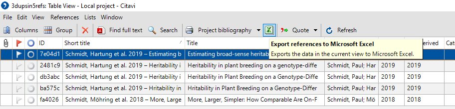

```{r, include = FALSE}
knitr::opts_chunk$set(
  collapse = TRUE,
  comment = "#>",
  fig.path = "man/figures/README-",
  out.width = "100%"
)
```

# CitaviR

<!-- badges: start -->
<!-- badges: end -->

The reference management software [Citavi](https://www.citavi.com/de) allows for [exports to Excel](https://www1.citavi.com/sub/manual6/en/index.html?exporting_to_excel.html). With a bit of effort (i.e. via customized [Citavi Macros](https://www1.citavi.com/sub/manual6/en/index.html?add_on_display_macros.html)) it also allows for [imports from Excel](https://github.com/Citavi/Macros/blob/master/CIM%20Import/CIM007%20Import%20arbitrary%20data%20from%20Microsoft%20Excel%20into%20custom%20fields%20of%20existing%20references%20by%20short%20title/readme.de.md). `CitaviR` provides functionality for dealing with the data while it is *outside* Citavi to get the most out of it. 

## Installation

You can install the development version of `CitaviR` from GitHub:

```{r install_devtools, eval=FALSE}
devtools::install_github('SchmidtPaul/CitaviR')
```


## Example

This is an example showing an entire work flow from start to finish. It is structured as five steps:

 * [Step 1: Citavi to xlsx](#step-1-citavi-to-xlsx)
 * [Step 2: xlsx to R](#step-2-xlsx-to-r)
 * [Step 3: Process data in R](#step-3-process-data-in-r)
 * [Step 4: R to xlsx](#step-4-r-to-xlsx)
 * [Step 5: xlsx to Citavi](#step-5-xlsx-to-citavi)

### Step 1: Citavi to xlsx

In your Citavi project open the table view.

```{r, echo=FALSE, out.width = "30%"}
knitr::include_graphics("img/Citavi_Table.png")
```

Make sure all relevant columns are selected (e.g. via Citavi's [customizable selection presets](https://www1.citavi.com/sub/manual6/en/index.html?referencegridformworkspaceeditor.html)) and export to an Excel file.

```{r, echo=FALSE, out.width = "100%"}

```

### Step 2: xlsx to R

The Excel file exported above is available as an example dataset of `CitaviR`. Furthermore, `read_Citavi_xlsx()` offers an import function based on `readxl::read_xlsx()` with some functionality specifically for xls/xlsx files created with Citavi via export to Excel.

```{r example}
library(CitaviR)

path <- example_xlsx('3dupsin5refs.xlsx') # replace with path to your xlsx file
read_Citavi_xlsx(path)
```

### Step 3: Process data in R

At this point there are many things one may wish to do with the data. In this example we will make use of the `CitaviR` functions to identify *obvious duplicates* and *potential duplicates*.

#### 3a: Obvious duplicates

TO DO

#### 3b: Likely duplicates

TO DO

### Step 4: R to xlsx

TO DO

### Step 5: xlsx to Citavi

TO DO
