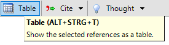
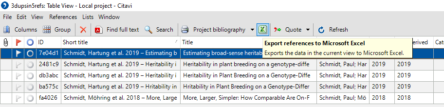
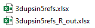

# CitaviR

<!-- badges: start -->

[](https://www.repostatus.org/#active)
[](https://www.tidyverse.org/lifecycle/#experimental)
[](https://travis-ci.com/SchmidtPaul/CitaviR)
<!-- badges: end -->

The reference management software [Citavi](https://www.citavi.com/de)
allows for [exports to
Excel](https://www1.citavi.com/sub/manual6/en/index.html?exporting_to_excel.html).
With a bit of effort (i.e. via customized [Citavi
macros](https://www1.citavi.com/sub/manual6/en/index.html?add_on_display_macros.html))
it also allows for [imports from
Excel](https://github.com/Citavi/Macros/blob/master/CIM%20Import/CIM007%20Import%20arbitrary%20data%20from%20Microsoft%20Excel%20into%20custom%20fields%20of%20existing%20references%20by%20short%20title/readme.de.md).
`CitaviR` provides functionality for dealing with the data while it is
*outside* Citavi to get the most out of it.

## Installation

You can install the development version of `CitaviR` from GitHub:

``` r
devtools::install_github('SchmidtPaul/CitaviR')
#> 
#>          checking for file 'C:\Users\PSchmidt\AppData\Local\Temp\RtmpqgfH5x\remotesc4011425cac\SchmidtPaul-CitaviR-700e3cb/DESCRIPTION' ...  v  checking for file 'C:\Users\PSchmidt\AppData\Local\Temp\RtmpqgfH5x\remotesc4011425cac\SchmidtPaul-CitaviR-700e3cb/DESCRIPTION'
#>       -  preparing 'CitaviR':
#>    checking DESCRIPTION meta-information ...     checking DESCRIPTION meta-information ...   v  checking DESCRIPTION meta-information
#>       -  checking for LF line-endings in source and make files and shell scripts
#>       -  checking for empty or unneeded directories
#>       -  building 'CitaviR_0.1.0.tar.gz'
#>      
#> 
```

## Example / Workflow

This is an example showing an entire work flow from start to finish. It
is structured in five steps:

| Step                                                   | CitaviR              | Effort: 1st time setup | Effort: regular use |
| ------------------------------------------------------ | -------------------- | ---------------------- | ------------------- |
| [Step 1: Citavi to xlsx](#step-1-citavi-to-xlsx)       |                      | :ok\_hand:             | :smiley:            |
| [Step 2: xlsx to R](#step-2-xlsx-to-r)                 | :heavy\_check\_mark: | :smiley:               | :smiley:            |
| [Step 3: Process data in R](#step-3-process-data-in-r) | :heavy\_check\_mark: | :ok\_hand:             | :smiley:            |
| [Step 4: R to xlsx](#step-4-r-to-xlsx)                 | :heavy\_check\_mark: | :smiley:               | :smiley:            |
| [Step 5: xlsx to Citavi](#step-5-xlsx-to-citavi)       |                      | :fire:                 | :ok\_hand:          |

**Effort levels:** low effort :smiley:; acceptable effort :ok\_hand:;
can be cumbersome :fire:

### Step 1: Citavi to xlsx

In your Citavi project open the table view.



Make sure all relevant columns are selected (e.g. via Citavi’s
[customizable selection
presets](https://www1.citavi.com/sub/manual6/en/index.html?referencegridformworkspaceeditor.html))
and export to an Excel file.



### Step 2: xlsx to R

The Excel file exported above is available in `CitaviR` as the example
dataset `3dupsin5refs.xlsx`. Furthermore, `read_Citavi_xlsx()` offers an
import function based on `readxl::read_xlsx()` with some functionality
specifically for xls/xlsx files created with Citavi via export to Excel.

``` r
library(CitaviR)

path   <- example_xlsx('3dupsin5refs.xlsx') # replace with path to your xlsx file
CitDat <- read_Citavi_xlsx(path)

CitDat
#> # A tibble: 5 x 19
#>   ID    `Short title` Title Year  Author Categories Groups Abstract `DOI name`
#>   <chr> <chr>         <chr> <chr> <chr>  <lgl>      <chr>  <chr>    <chr>     
#> 1 7e04~ Schmidt, Har~ Esti~ 2019  Schmi~ NA         Googl~ Broad-s~ <NA>      
#> 2 2481~ Schmidt, Har~ Heri~ 2019  Schmi~ NA         Googl~ In plan~ <NA>      
#> 3 db3a~ Schmidt, Har~ Heri~ 2019  Schmi~ NA         PubMed In plan~ <NA>      
#> 4 ba57~ Schmidt, Har~ Hrit~ 2019  Schmi~ NA         TypoDB In plan~ 10.1534/g~
#> 5 fa40~ Schmidt, Möh~ More~ 2018  Schmi~ NA         Googl~ Traditi~ <NA>      
#> # ... with 10 more variables: `PubMed ID` <chr>, `Online address` <chr>,
#> #   Periodical <chr>, Volume <chr>, Number <chr>, `Page range` <chr>,
#> #   Locations <chr>, has_attachment <lgl>, red_flag <lgl>, blue_circle <lgl>
```

### Step 3: Process data in R

At this point there are many things one may wish to do with the data. In
this example we will make use of the `CitaviR` functions to identify and
handle *obvious duplicates*.

#### find obvious duplicates

``` r
CitDat <- CitDat %>% 
  find_obvious_dups()
```

One way of identifying *obvious duplicates* is via
`CitaviR::find_obvious_dups()`. In short, it first creates a
`clean_title` by combining each reference’s `Title` and `Year` into a
simplified string. This simplification *e.g.* converts to all-lowercase,
removes special characters and removes unnecessary spaces. If two
references have the same `clean_title`, they are identified as *obvious
duplicates*. In this example, two references were indeed identified as
*obvious duplicates*:

``` r
CitDat[, c("Title", "Year", "clean_title", "clean_title_id", "has_obv_dup", "obv_dup_id")]
#> # A tibble: 5 x 6
#>   Title          Year  clean_title         clean_title_id has_obv_dup obv_dup_id
#>   <chr>          <chr> <chr>               <chr>          <lgl>       <chr>     
#> 1 Estimating br~ 2019  estimating_broad_s~ ct_01          FALSE       dup_01    
#> 2 Heritability ~ 2019  heritability_in_pl~ ct_02          TRUE        dup_01    
#> 3 Heritability ~ 2019  heritability_in_pl~ ct_02          TRUE        dup_02    
#> 4 Hritability i~ 2019  hritability_in_pla~ ct_03          FALSE       dup_01    
#> 5 More, Larger,~ 2018  more_larger_simple~ ct_04          FALSE       dup_01
```

#### handle obvious duplicates

At this point we have already gained information and could continue with
steps 4 and 5. However, sometimes duplicates hold different information
as it is the case here for `ct_02` and the columns `PubMed ID` and
`Online address`:

``` r
CitDat[2:3, c("clean_title_id", "obv_dup_id", "Title", "PubMed ID", "Online address")]
#> # A tibble: 2 x 5
#>   clean_title_id obv_dup_id Title              `PubMed ID` `Online address`     
#>   <chr>          <chr>      <chr>              <chr>       <chr>                
#> 1 ct_02          dup_01     Heritability in p~ <NA>        https://www.genetics~
#> 2 ct_02          dup_02     Heritability in P~ 31248886    <NA>
```

In such a scenario it would be nice to gather all information into the
one *non-duplicate* (=`dup_01`) that will be kept and evaluated later
on. Here, `CitaviR::handle_obvious_dups()` comes in handy:

``` r
CitDat <- CitDat %>% 
  handle_obvious_dups()

CitDat[2:3, c("clean_title_id", "obv_dup_id", "Title", "PubMed ID", "Online address")]
#> # A tibble: 2 x 5
#>   clean_title_id obv_dup_id Title              `PubMed ID` `Online address`     
#>   <chr>          <chr>      <chr>              <chr>       <chr>                
#> 1 ct_02          dup_01     Heritability in p~ 31248886    https://www.genetics~
#> 2 ct_02          dup_02     Heritability in P~ 31248886    <NA>
```

### Step 4: R to xlsx

To export this table to Excel, `write_Citavi_xlsx()` offers an import
function based on `openxlsx::write.xlsx()` with some extra
functionality. For example, when supplying the same `path` we used for
`read_Citavi_xlsx()` in [Step 2](#step-2-xlsx-to-r), the xlsx file will
be created in the same folder with a slightly altered name:

``` r
write_Citavi_xlsx(CitDat, read_path = path) # will not work for this example dataset
```



### Step 5: xlsx to Citavi

Unfortunately, importing xlsx into Citavi is not as trivial as exporting
xlsx from it. In order to generally make this work you must first

  - [enable Citavi
    macros](https://www1.citavi.com/sub/manual6/en/index.html?add_on_display_macros.html)
  - install an *OLE-DB-Provider*. Citavi suggests the *Microsoft Access
    Database Engine 2016 Redistributable Kit* as described [here in
    German](https://github.com/Citavi/Macros/blob/master/CIM%20Import/CIM007%20Import%20arbitrary%20data%20from%20Microsoft%20Excel%20into%20custom%20fields%20of%20existing%20references%20by%20short%20title/readme.de.md).

Afterwards, you should be able to run the macro [**CIM007** Import
arbitrary data from Microsoft Excel into custom fields of existing
references by short
title](https://github.com/Citavi/Macros/tree/master/CIM%20Import/CIM007%20Import%20arbitrary%20data%20from%20Microsoft%20Excel%20into%20custom%20fields%20of%20existing%20references%20by%20short%20title)
provided by Citavi.

> Note that it is this very macro **CIM007** that makes all of this
> possible. Without it, `CitaviR` would not nearly be as useful since -
> according to my knowledge - there is currently no other way to import
> Excel data into Citavi.

However, we are not actually going to use the original *CIM007* macro
here, but a modified version of it. The main reason is that *CIM007*
merges the imported data by `Short title`. However, for duplicates the
short titles are identical. Instead, we want to merge by `ID` because it
is a unique identifier for each reference.

TO DO: LINK TO REPO WITH CUSTOM CITAVI MACROS WILL FOLLOW HERE

TO DO: SCREENSHOT
