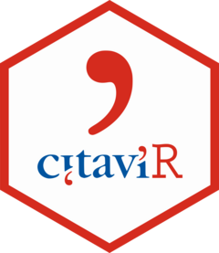
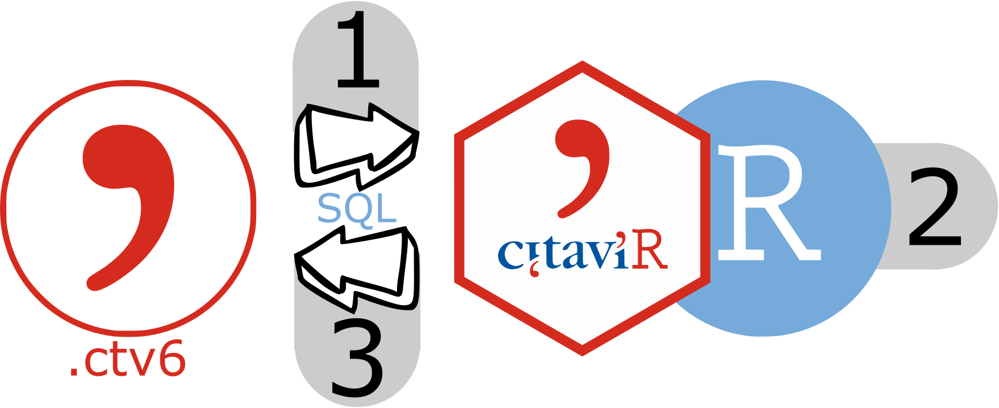

# CitaviR 

<!-- badges: start -->

[](https://www.repostatus.org/#unsupported)
[](https://www.tidyverse.org/lifecycle/#deprecated)

> **⚠️ This package is no longer maintained.**
>
> CitaviR was built for **Citavi 6 local projects** (.ctv6 files accessed via SQL). Citavi has since transitioned to a cloud-based model, and — critically — **still does not offer any API access nor has announced plans to do so**. This makes it impossible to build or maintain reliable programmatic integrations with current versions of Citavi.
>
> The package remains available on GitHub for reference, but no further development or bug fixes are planned.

---

**Citavi** ([Official Website](https://www.citavi.com/de), [Official
GitHub](https://github.com/Citavi)) is a software program for reference
management and knowledge organization. When working with [local Citavi
projects](https://www1.citavi.com/sub/manual6/en/index.html?101_creating_a_local_project.html)
(as opposed to
[cloud](https://www1.citavi.com/sub/manual6/en/index.html?101_creating_a_cloud_project.html)
or
[server](https://www1.citavi.com/sub/manual6/en/index.html?101_creating_a_server_project.html)
projects) you can directly work on the (database stored in) the `.ctv6`
file via SQL. `CitaviR` provides functionality for

1.  reading the data from the `.ctv6` file
2.  dealing with the data while it is *outside* Citavi to get the most
    out of it
3.  writing/updating the data into the `.ctv6` file



## Installation

You can install the development version of `CitaviR` from GitHub:

``` r
devtools::install_github('SchmidtPaul/CitaviR')
```

### Example

You can find an example workflow on the [**Get Started
page**](https://schmidtpaul.github.io/CitaviR/articles/CitaviR.html).
